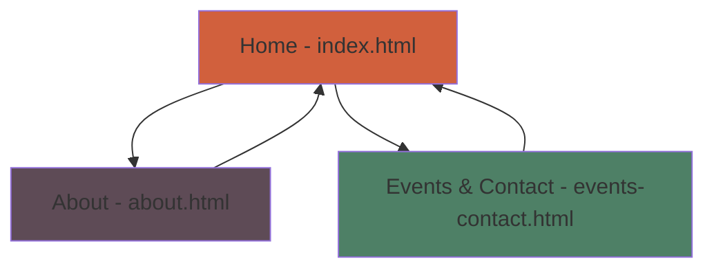

# 📋 Kopli Couture Website Planning Roadmap

## 🎯 Project Purpose

The website serves as the homepage for Kopli Couture, a unique venue in Tallinn that operates as a vintage clothing shop inspired by ex-USSR aesthetics during the day and transforms into a cocktail bar by night. It acts as a hub for local designers, eclectic artists, and vintage enthusiasts, hosting fashion shows featuring glamorous models in increasingly extravagant vintage attire. The site aims to capture this dual vibe—retro, nostalgic, and artistic—while providing information on the shop, bar, events, and community. Target audience: Artsy locals, fashion fans, and tourists seeking authentic, eclectic experiences.

The website will be simple, using only vanilla HTML, CSS, and JavaScript (no frameworks), with a vintage USSR-inspired design: muted colors (e.g., deep reds, blacks, golds), retro fonts (e.g., serif or typewriter-style), subtle grainy textures, and animations for a dynamic day/night feel. It must include a home page and at least two sub-pages, with JS for interactivity to aim for top grades.

## 👥 Team Members

- **Heleri Tammemägi**
- **Arphine Pogosjan**
- **Tom Kristian Abel**

## 📊 Site Structure Analysis

Based on the project theme and requirements (home + 2 sub-pages), the simplified core structure will include:

- **Home Page (`index.html`)**: A hero section introducing Kopli Couture. Will include a simple JavaScript-powered day/night theme toggle.
- **About Page (`about.html`)**: Tells the story of the venue and describes its unique, dual-personality vibe.
- **Events & Contact Page (`events-contact.html`)**: Features a static gallery of past events and a simple contact form.

This structure meets the minimum requirements, allows for a cohesive design, and provides clear opportunities for meaningful JavaScript implementation without being overly complex.

### Navigation Flow (Mermaid Diagram)

## 🔧 Task Breakdown

Tasks are simplified to align with the core grading criteria of `REQUIREMENTS.md`.

1. **Git & File Structure**
    - Define a simple branching strategy (`main` and `feature` branches).
    - Create the basic file structure: `index.html`, `about.html`, `events-contact.html`, a single `styles/styles.css`, and `scripts/main.js`.

2. **HTML Structure**
    - Build semantic HTML for the Home page.
    - Build semantic HTML for the About and Events & Contact pages.

3. **CSS Styling**
    - Create a single, shared `styles.css` file for the vintage theme (colors, fonts, layout).
    - Ensure styles are consistent across all pages and the site is responsive.

4. **JavaScript Interactivity**
    - Implement a day/night theme toggle on the Home page (e.g., changing a class on the `<body>`).
    - Add basic JavaScript validation to the contact form.
    - Ensure all JS code is commented in Estonian.

5. **Content & Documentation**
    - Write and add all website text.
    - Integrate images from the `media/` folder into the pages.
    - **Crucially**, fill out the `README.md` with the project purpose, team members, and a clear division of labor.

6. **Validation & Deployment**
    - Validate all HTML and CSS using the W3C validator.
    - Test the site for functionality and browser compatibility.
    - Deploy the final project to `kodu.ut.ee`.

## 👷 Division of Labor (Revised)

This revised allocation is designed for simplicity and balance. Tom will set up the initial file structure, allowing Heleri and Arphine to focus on building out specific pages. This ensures consistency and leverages the experienced member for setup and guidance.

- **Heleri Tammemägi**:
  - **HTML**: Populate and structure the `index.html` file with content for the Home page.
  - **CSS**: Add shared theme styles (e.g., fonts, colors, background) to the `styles/styles.css` file.
  - **Documentation**: Write the "Project Purpose" section in the `README.md`.

- **Arphine Pogosjan**:
  - **HTML**: Populate and structure the `about.html` and `events-contact.html` files.
  - **CSS**: Add styles for the About and Events/Contact pages to `styles/styles.css`.
  - **Content**: Integrate images into the static gallery and other pages.

- **Tom Kristian Abel**:
  - **File Structure**: Create the initial boilerplate files: `index.html`, `about.html`, `events-contact.html`, `styles/styles.css`, and `scripts/main.js`.
  - **JavaScript**: Implement the theme toggle and form validation in `scripts/main.js`. Provide mentorship on JS concepts.
  - **Git & Code Review**: Define the branching strategy, review all pull requests, and manage merges to `main`.
  - **Deployment**: Handle the final validation and deploy the website to `kodu.ut.ee`.
  - **Documentation**: Oversee the `README.md` to ensure it is complete and accurate.
